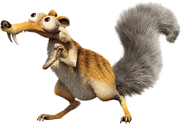

  ```c++
  #include <stdio.h>;

  int main(void) {
    const char *NOME = "Caubi Loureiro";
    char *hobby[] = {"futebol", "games", "CTF"};
    char *profissao = "Hacker Ético";
    char *curso = "Ciências da Computação na UFF";

    return 0;
  }
  ```
  
<div id="contatos">
  <br>
  <h3> Como entrar em contato? </h3>
   
  <a href='https://www.linkedin.com/in/caubi-de-souza-loureiro-rosa-7556b41b5/'> </a>
  <a href="https://app.hackthebox.com/profile/937855/"></a>
  <a href="https://tryhackme.com/p/F4natic"></a>
</div>
